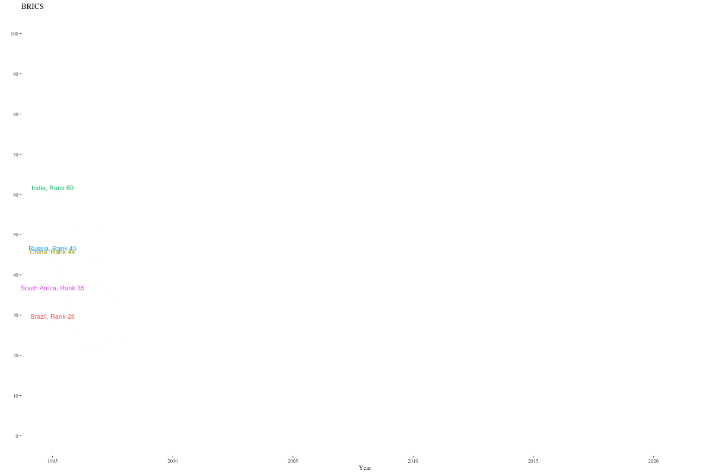

# BRICS: Brazil, Russia, India, China, and South Africa

The five countries comprising BRICS exported a combined **5,380 Billion USD worth** of Goods and Services in 2021.  

**Figure 0: Economic Complexity Ranking**
  

 

**Figure 1: Life Expectancy at Birth**

**Figure 2: Food Exports as a % of all Exports**

**Figure 3: Debt Service on External Debt in Billions USD**

**Figure 4: Brazil Exports. 335 Billion USD**

**Figure 5: Russian Exports. 560 Billion USD**

**Figure 6: India Exports. 638 Billion USD**

**Figure 7: China Exports. 3,700 Billion USD**

**Figure 8: South Africa. 147 Billion USD**

