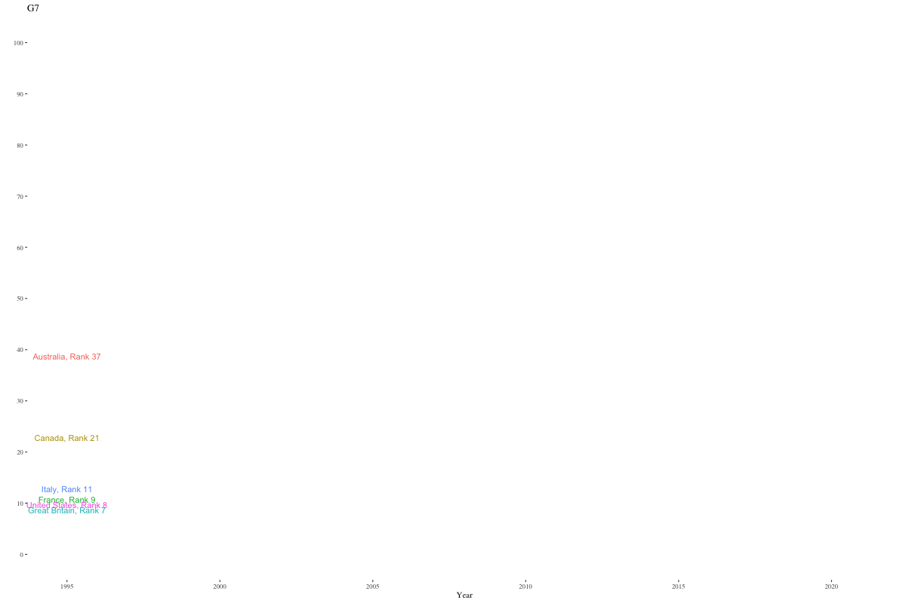
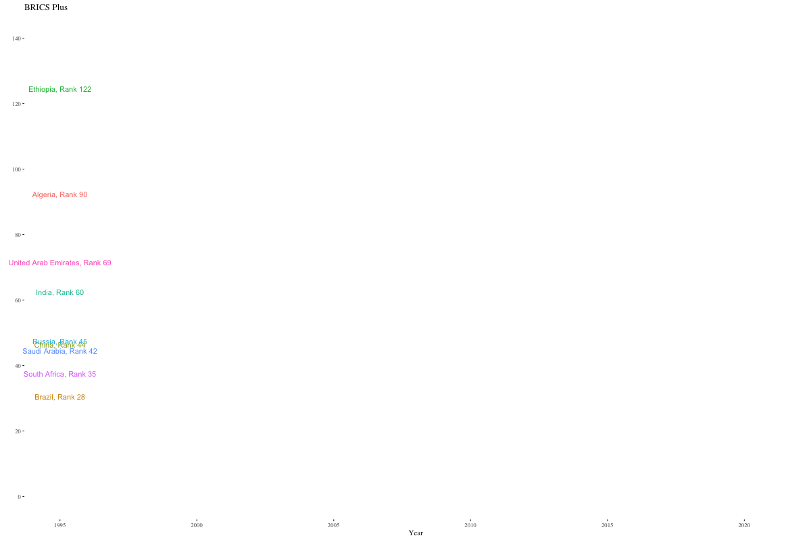

# BRICS: Brazil, Russia, India, China, and South Africa

The five countries comprising BRICS exported a combined **5,4 Trillion USD worth** of Goods and Services in 2021.  

# Tutorial

**Figure 0: Economic Complexity Ranking**
  

 

**Figure 1: Life Expectancy at Birth**

**Figure 2: Food Exports as a % of all Exports**

**Figure 3: Debt Service on External Debt in Billions USD**

**Figure 4: Brazil Exports. 335 Billion USD**

**Figure 5: Russian Exports. 560 Billion USD**

**Figure 6: India Exports. 638 Billion USD**

**Figure 7: China Exports. 3,700 Billion USD**

**Figure 8: South Africa. 147 Billion USD**

# BRICS EXPORTS 

# BRICS IMPORTS 
## BRICS+
These countries are not members of BRICS. They do, however, have established trading relationships with BRICS countries, and some of them have already applied to join BRICS [1]. 

**1. Saudi Arabia**

**2. United Arab Emirates**

**3. Oman**

**4. Qatar**

**5. Bahrain**

**6. Egypt**

**7. Jordan**

**8. Algeria**

**9. Morocco**

**10. Tunisia**

# References 
1. Brics+ countries exported a Billion USD to BRICS countries in 2021. 
